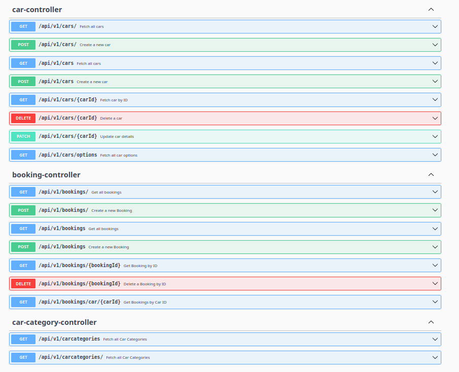
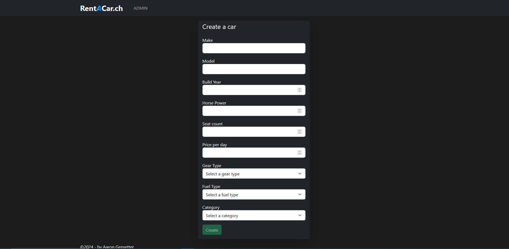
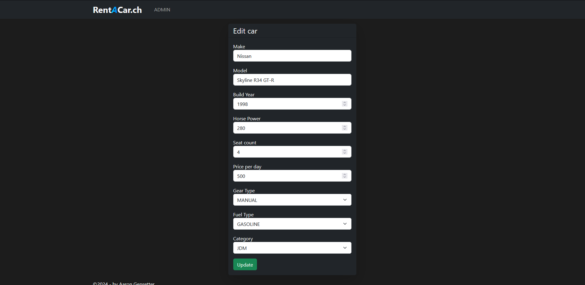

# RentACar

Ein Schulprojekt für eine Autovermietungs-Webanwendung, entwickelt mit React und Spring.

## Technische Dokumentation

### Übersicht

RentACar ist eine Webanwendung, die es Benutzern ermöglicht, Fahrzeuge online zu mieten. Das Projekt wurde im Rahmen eines Schulprojekts entwickelt und nutzt moderne Webtechnologien für Frontend und Backend.

### Verwendete Technologien

- **Frontend**: React -> Typescript
- **Backend**: Spring -> Java

### Genutzte Libraries

#### Frontend

- **Abhängigkeiten**:

  - `@popperjs/core`: Tooltip- und Popover-Positionierung.
  - `bootstrap`: Styling-Framework für responsives Design.
  - `bootstrap-icons`: Symbolbibliothek für Icons.
  - `react`: Bibliothek für Benutzeroberflächen.
  - `react-calendar`: Kalenderkomponente.
  - `react-datepicker`: Komponente für die Datumsauswahl.
  - `react-dom`: Rendering-Bibliothek für React.
  - `react-router-dom`: Routing-Bibliothek für React.

- **Entwicklungsabhängigkeiten**:
  - `@eslint/js`: Linter für JavaScript.
  - `@jest/globals`: Jest-Globale für Tests.
  - `@testing-library/dom`, `@testing-library/react`, `@testing-library/jest-dom`, `@testing-library/user-event`: Testbibliotheken für React-Komponenten.
  - `@types/react`, `@types/react-dom`: TypeScript-Typen für React.
  - `@vitejs/plugin-react`: Vite-Plugin für React-Projekte.
  - `eslint`, `eslint-plugin-react-hooks`, `eslint-plugin-react-refresh`: Linter und Plugins für React und Hooks.
  - `globals`: Liste bekannter globaler Variablen.
  - `jest`, `jest-environment-jsdom`, `jest-localstorage-mock`: Test-Framework und Umgebungs-Simulation.
  - `prettier`: Code-Formatter.
  - `ts-jest`: TypeScript-Integration für Jest.
  - `ts-node`, `typescript`, `typescript-eslint`: Tools für TypeScript-Entwicklung.
  - `vite`: Build-Tool für moderne Webprojekte.

#### Backend

- **Spring Boot**: Basis-Framework für die Backend-Entwicklung.
- **Spring Boot Starter Data JPA**: ORM und Datenbankintegration.
- **Spring Boot Starter Web**: Web- und REST-APIs.
- **Spring Boot Starter Validation**: Validierung von Benutzereingaben.
- **Spring Boot Starter Test**: Test-Suite für Spring-Anwendungen.
- **Springdoc OpenAPI**: OpenAPI-Unterstützung für automatische API-Dokumentation.
- **Mockito**: Mocking-Framework für Tests.
- **Lombok**: Reduziert Boilerplate-Code in Java.
- **Logback Classic**: Logging-Framework.
- **MySQL Connector**: Datenbanktreiber für MySQL.
- **Kotlin Libraries**:
  - `kotlin-stdlib-jdk8`: Standardbibliothek für Kotlin.
  - `kotlin-test`: Testbibliothek für Kotlin.

### Datenbankstruktur

Die folgende Tabelle beschreibt die in der Datenbank definierten Tabellen und ihre Attribute. Die Datenbank wird verwendet, um Fahrzeuginformationen, Buchungen und Fahrzeugkategorien zu speichern.

| **Tabelle**       | **Attribute**                                                    | **Beschreibung**                                                          |
| ----------------- | ---------------------------------------------------------------- | ------------------------------------------------------------------------- |
| **bookings**      | - `Bid` (int, Primary Key, AUTO_INCREMENT)                       | Eindeutige ID der Buchung.                                                |
|                   | - `Cid` (int, Foreign Key)                                       | ID des gebuchten Fahrzeugs (verweist auf `cars.Cid`).                     |
|                   | - `BstartDate` (date)                                            | Startdatum der Buchung.                                                   |
|                   | - `BendDate` (date)                                              | Enddatum der Buchung.                                                     |
|                   | - `BcreationDate` (timestamp, Default: `current_timestamp()`)    | Erstellungszeitpunkt der Buchung.                                         |
|                   | - `BcalculatedPrice` (float)                                     | Berechneter Gesamtpreis der Buchung.                                      |
| **carcategories** | - `CCid` (int, Primary Key, AUTO_INCREMENT)                      | Eindeutige ID der Fahrzeugkategorie.                                      |
|                   | - `CCname` (varchar(255))                                        | Name der Fahrzeugkategorie (z. B. "SUV", "JDM").                          |
|                   | - `CCimage` (varchar(255))                                       | Bilddateiname der Fahrzeugkategorie.                                      |
| **cars**          | - `Cid` (int, Primary Key, AUTO_INCREMENT)                       | Eindeutige ID des Fahrzeugs.                                              |
|                   | - `Cmake` (varchar(255))                                         | Hersteller des Fahrzeugs (z. B. "Toyota").                                |
|                   | - `Cmodel` (varchar(255))                                        | Modell des Fahrzeugs (z. B. "Camry").                                     |
|                   | - `CbuildYear` (int)                                             | Baujahr des Fahrzeugs.                                                    |
|                   | - `Chorsepower` (int)                                            | Leistung des Fahrzeugs in PS.                                             |
|                   | - `Cseatscount` (int)                                            | Anzahl der Sitzplätze im Fahrzeug.                                        |
|                   | - `CpricePerDay` (float)                                         | Mietpreis pro Tag in Euro.                                                |
|                   | - `CgearType` (enum: 'AUTOMATIC', 'MANUAL')                      | Getriebetyp des Fahrzeugs.                                                |
|                   | - `CfuelType` (enum: 'GASOLINE', 'DIESEL', 'ELECTRIC', 'HYBRID') | Kraftstofftyp des Fahrzeugs.                                              |
|                   | - `CCid` (int, Foreign Key)                                      | ID der zugehörigen Fahrzeugkategorie (verweist auf `carcategories.CCid`). |

#### Beziehungen

- **Bookings ↔ Cars**:
  - Eine Buchung (`bookings`) referenziert ein Fahrzeug (`cars`) über die `Cid`-Spalte. Die Beziehung wird durch die Foreign Key Constraint `bookings_cars` sichergestellt.
- **Cars ↔ Carcategories**:
  - Ein Fahrzeug (`cars`) gehört zu einer Fahrzeugkategorie (`carcategories`) über die `CCid`-Spalte. Diese Beziehung wird durch die Foreign Key Constraint `cars_carcategories_fk` abgebildet.


### Software Architektur

Die Anwendung folgt einer klassischen Client-Server-Architektur:

- **Frontend**: Das React-basierte Frontend bietet eine interaktive Benutzeroberfläche, über die Nutzer Fahrzeuge durchsuchen und mieten können.
- **Backend**: Das Spring-basierte Backend stellt RESTful APIs bereit, um Daten zu verwalten und Geschäftslogik zu implementieren.
- **Datenbank**: Informationen zu Fahrzeugen, Benutzern und Mietvorgängen werden in einer relationalen Datenbank gespeichert.


### Backend - REST API Routes

Siehe Swagger UI

http://localhost:8081/swagger-ui/index.html



**The GET and POST / is double because of "@GetMapping(value = {"", "/"})", it counts as two entries for some reason**

### Frontend Routes

#### `/` (Landing Page)

Startseite. Hier werden alle Autos angezeigt, Hier kann man auch filtern


Filter im Einsatz


#### `/cars/:carId` (Car Details Page)

Zeigt detailierte infos über das ausgewählte auto an
Buchungen können hier gemacht werden.,


#### `/cars/booked/:bookingId` (Car Booked Confirmation Page)

Bestätigung nach dem Buchen


#### `/admin` (Admin Dashboard)

Admin Landing Page
Hier werden alle autos aufgelistst


#### `/admin/cars/create` (Create Car Page)

Hier kann ein auto erstellt werden


#### `/admin/cars/:carId` (Admin Car Detail Page)

Admin übersicht eines autos


#### `/admin/cars/:carId/edit` (Edit Car Page)

Hier kann ein Auto editiert werden


## Installation

### Voraussetzungen

- Libraries installiert
- Node.js (für das Frontend)
- Java Development Kit (JDK) (für das Backend)
- Ein relationales Datenbankmanagementsystem (z. B. MySQL)

### Schritte

1. **Repository klonen**:

   ```bash
   git clone https://github.com/HATBE/RentACar.git
   cd RentACar
   ```

2. **Dependencies Installieren && starten**:
   ```bash
   cd frontend
   npm i
   npm run dev -> devserver
   npm run start -> server
   cd ..
   ```
3. **Dependencies Installieren && starten**:
   ```bash
   cd backend
   mvn install
   mvn start
   cd ..
   ```
